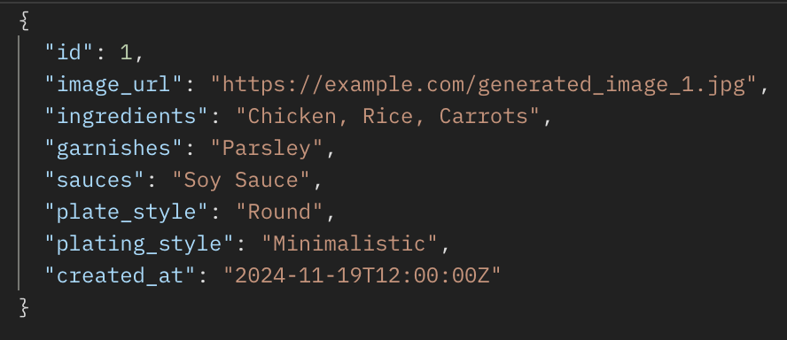

# Project Title

PlatePal: AI-Powered Food Plating Designer

## Overview

PlatePal is a React-based web app that uses OpenAI’s DALL·E API to help users design creative and aesthetically pleasing plating for their home cooked meals. Users input details such as ingredients, garnishes, sauces, plating types, and desired plating style, and the app generates an AI-designed image of the plating. Users can browse a gallery of all previously generated images, view user inputs for each design, and build a growing collection of designs.

### Problem Space

Plating food beautifully is an art that many people struggle with, whether they’re home cooks, food bloggers, or culinary enthusiasts. This app addresses the lack of accessible tools for improving plating creativity and presentation. By leveraging AI to generate tailored plating designs, PlatePal reduces the guesswork and inspires creativity.

### User Profile

Target Audience:
- Home cooks looking to elevate their presentation.
- Food bloggers seeking unique plating ideas.
- Culinary students or professionals exploring new styles of plating.

How They Use It:
- Enter meal details to receive AI-generated plating ideas.
- Explore the growing gallery for inspiration.
- Share generated designs with others.

Considerations:
- Ensure simple and intuitive navigation.

### Features

- As a user, I want a straighforward and personal experience to see how I can plate the food I made.
- As a user, I want to have a easy way to learn how to plate the food I cooked.
- As a user, I want to have a simple way to give me ideas on plating the food I already made.
- As a user, I want a quick way to have a custom idea of plating for my food.
- As a user, I want to see what other people are trying to plate.
- As a user, I want to see other plating designs for food I haven't made.
- As a user, I want to see what others used (in terms of food) to create their plating designs.

Home Page:
- Welcome message and introduction to the app.
- Call-to-action for generating a design or viewing the gallery.

Input Form Page:
- Form for users to input meal details:
    Ingredients, garnishes, sauces, plating type, and style.
- Validate user input before submission.

Generated Image Page:
- Display the AI-generated plating image.
- Show the user’s input metadata.
- Options to save the design to gallery or start over.

Gallery Page:
- Display all previously generated designs in a responsive grid.
- Allow users to click on an image to view more details.

Single Image Page:
- Display one selected image with metadata on how the image was created.

## Implementation

### Tech Stack

- Front End: React, React Router, Axios, SASS.
- Back End: Node.js, Express.js, Knex.
- Database: mySQL for storing images and metadata.

(Not a part of MVP)

Deployment:
- Front End: Netlify.
- Back End: Render.
- Environment Management: dotenv for secure API keys.

### APIs

OpenAI DALL·E: Used to generate images based on user input.

### Sitemap

- Home Page: Introduction and navigation.
- Input Form Page: User inputs meal details.
- Generated Image Page: Displays AI-generated design.
- Gallery Page: Displays all generated designs.
- Single Image Page: Displays one design and the meta data for user inputs.

### Mockups

Homepage:
 
Input Form Page:
 
 Generated Image Page:
  
Gallery Page:
 
Single Image Page:
 

### Data

### Endpoints

POST/images
 - post the generated image from API

Input:
 

 Response: 

GET/images
- getch a list of all generated images with their metadata

Reponse:

GET/images/:id
- fetch details of a specific image (by its id)
along with its metadata.

Response:

## Roadmap

1. Create Client (React)
- React project with routes and boilerplate pages
- Set up the React app using Create React App.
- Implement basic routing for Home, Input Form, Gallery, and Single Image pages using React Router.
2. Create Server (Express)
- Set up Express server
- Create an Express project to handle API requests (GET, POST, etc.).
- Implement basic routes with placeholder 200 responses for /images, /images/:id, etc.
3. Create Database Schema (mySQL)
- Set up mySQL and database schema
- Define the schema for storing images and metadata (ingredients, garnishes, sauces, plate style, plating style).
- Create tables with appropriate relationships.
4. Create Migrations
- Create database migrations for mySQL
- Write migration files to set up the database structure with the images table.
5. Create Mock Data and Seeds
- Create seeds with mock data
- Seed the database with some sample images and metadata to test the gallery functionality.
6. Implement Image Generation with DALL·E API
- Create POST /images endpoint
- Accept user input (ingredients, garnishes, sauces, plate style, plating style) and generate an image using the DALL·E API.
- Store the generated image and metadata in the database.
7. Fetch and Display Images
- Build and style gallery page
- Fetch the list of generated images from the /images endpoint.
- Display the images in a grid or gallery layout with their metadata.
- Add infinite scroll if necessary.
8. Single Image Page
- Build and style single image page
- Create a page to display a single image and its metadata when clicked from the gallery.
- Fetch the image data from /images/:id based on the image ID.
9. Add Environment Variables
- Add environment variables for OpenAI API and database credentials
- Securely store OpenAI API key and mySQL database credentials in .env files.

---

## Future Implementations

For future implementations we could add likes, and comments to the single image page for each image allowing users to engage with one anothers meal designs. 

We could also add a filtering and a search function for users to search the gallery for already generated images they could use to inspire their plating.

We could implement user authetication allowing users to save images on their profile and access their precious images.

We could also integrate social media sharing for users to share their generated plating design on apps such as Instagram, Facebook and X.

[def]: datatable.png